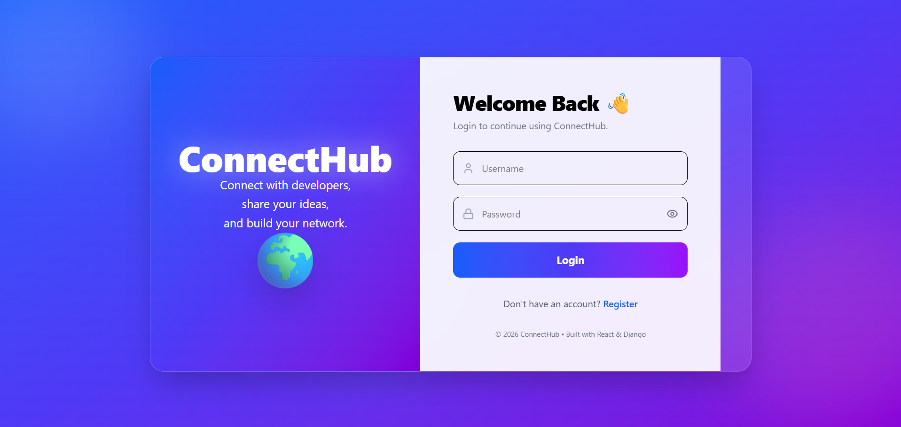
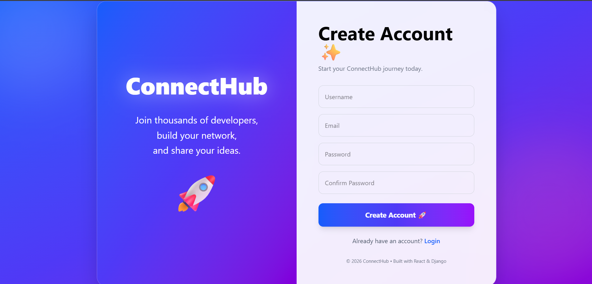
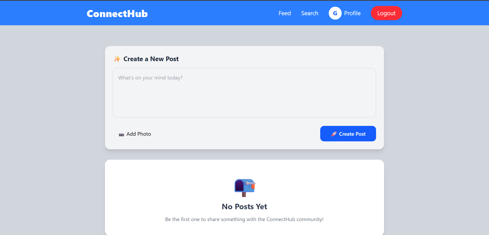
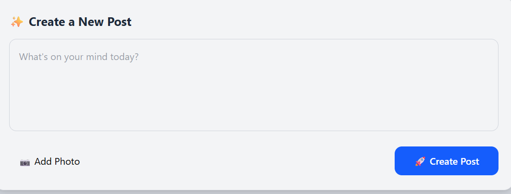
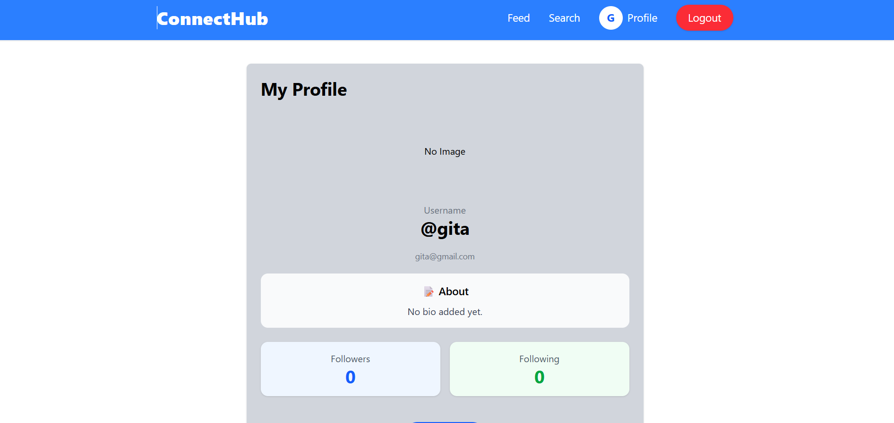
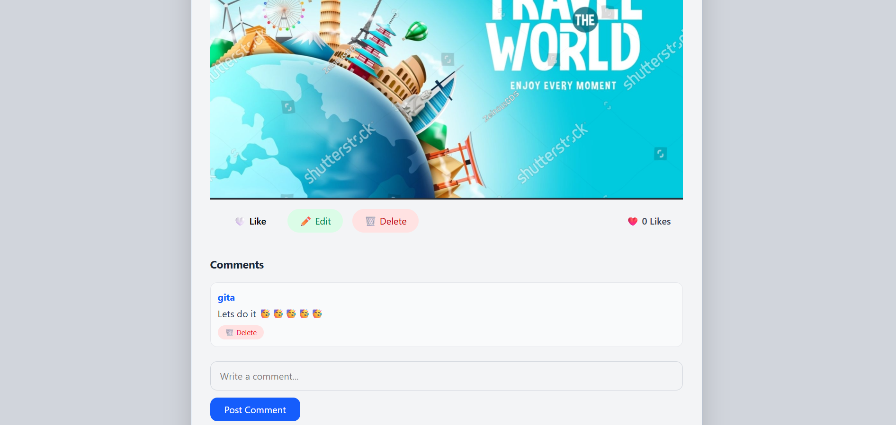
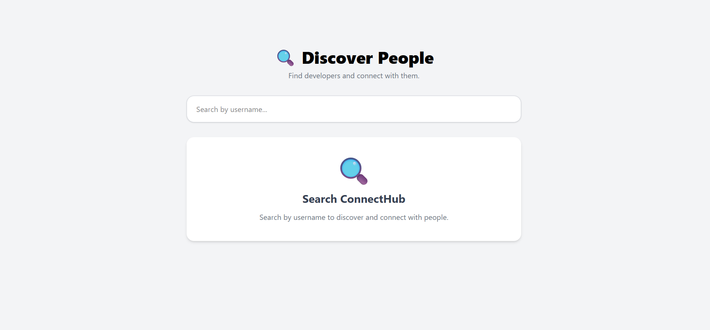
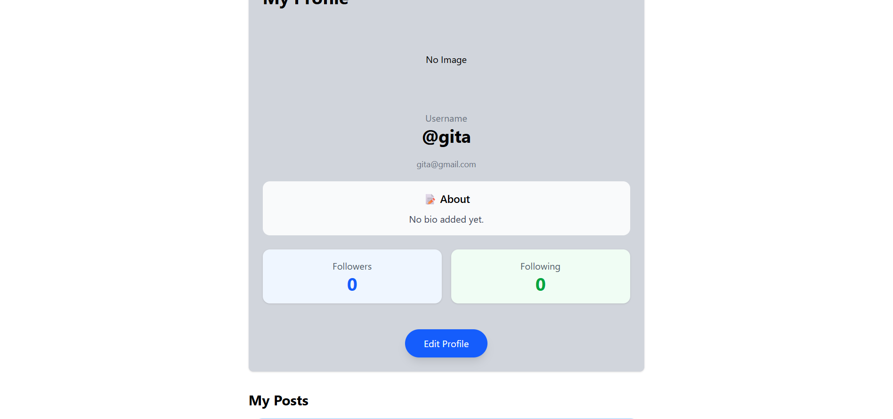

# 🌐 ConnectHub - Social Media Platform

A modern full-stack social media platform built with **React**, **Django REST Framework**, **PostgreSQL**, and **JWT Authentication**. ConnectHub allows users to create profiles, share posts, follow other users, interact through likes and comments, and manage their own social network in a clean and responsive interface.

---

## 🚀 Live Demo

🔗 **Frontend:** https://connecthub-frontend-rdwt.onrender.com

🔗 **Backend API:** https://connecthub-backend-dulc.onrender.com

---

## 📸 Screenshots

### Login



### Register



### Dashboard



### Create Post



### Profile



### Comments



### Search Users



### Edit Profile


---

# ✨ Features

### 🔐 Authentication
- User Registration
- Secure Login
- JWT Authentication
- Protected Routes
- Logout

### 👤 User Profile
- View Profile
- Edit Profile
- Upload Profile Picture
- Bio Support

### 📝 Posts
- Create Posts
- View Posts
- Edit Own Posts
- Delete Own Posts
- Image Upload Support

### ❤️ Social Features
- Like / Unlike Posts
- Comment on Posts
- Delete Own Comments
- Follow Users
- Unfollow Users
- Personalized Feed (Shows posts from followed users and your own posts)

### 🔍 Search & Filters
- Search Users
- Search Posts
- Ordering
- Pagination

### 🎨 User Interface
- Fully Responsive Design
- Modern UI
- Loading States
- Toast Notifications

---

# 🛠 Tech Stack

## Frontend

- React
- React Router DOM
- Axios
- Tailwind CSS
- React Hot Toast
- Lucide React

## Backend

- Django
- Django REST Framework
- Simple JWT
- PostgreSQL
- Django Filters
- Pillow
- CORS Headers

---

# 📂 Project Structure

```
ConnectHub
│
├── backend
│   ├── users
│   ├── posts
│   ├── comments
│   ├── config
│   └── manage.py
│
├── frontend
│   ├── components
│   ├── pages
│   ├── api
│   └── src
│
└── README.md
```

---

# ⚙️ Installation

## Clone Repository

```bash
git clone https://github.com/Unnati-singh-ai/connecthub-social-media.git
```

```
cd connecthub-social-media
```

---

# Backend Setup

```bash
cd backend
```

Create Virtual Environment

```bash
python -m venv venv
```

Activate

Windows

```bash
venv\Scripts\activate
```

Install Dependencies

```bash
pip install -r requirements.txt
```

Run Migrations

```bash
python manage.py migrate
```

Start Backend

```bash
python manage.py runserver
```

---

# Frontend Setup

```bash
cd frontend
```

Install Packages

```bash
npm install
```

Run Development Server

```bash
npm run dev
```

---

# API Highlights

| Method | Endpoint | Description |
|---------|----------|-------------|
| POST | `/api/users/register/` | Register User |
| POST | `/api/token/` | Login |
| GET | `/api/posts/feed/` | Personalized Feed |
| POST | `/api/posts/` | Create Post |
| PUT | `/api/posts/{id}/` | Update Post |
| DELETE | `/api/posts/{id}/` | Delete Post |
| POST | `/api/posts/{id}/like/` | Like/Unlike Post |
| GET | `/api/posts/user/{id}/` | User Posts |

---

# Future Improvements

- Real-time Notifications
- Real-time Chat
- Stories
- Hashtags
- Bookmarks
- Dark Mode
- Infinite Scrolling
- Email Verification

---

# Learning Outcomes

This project helped me gain practical experience with:

- Building REST APIs using Django REST Framework
- JWT Authentication & Authorization
- PostgreSQL Database Design
- React Hooks
- API Integration with Axios
- CRUD Operations
- Responsive UI Development
- Deployment using Render
- Git & GitHub Workflow

---

# Author

**Unnati Singh**

GitHub:
https://github.com/Unnati-singh-ai

LinkedIn:
(Add your LinkedIn profile after creating it)

---

## ⭐ If you like this project, consider giving it a Star!